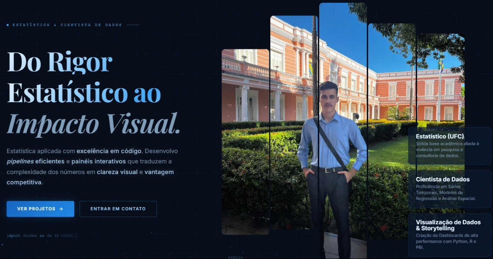

<a name="topo"></a>
<p align="center">
  
</p>

<h1 align="center">🌐 DOCHMO — Portfólio de Estatística, Data Science & Data Storytelling</h1>

<p align="center">
  <a href="https://pages.cloudflare.com"></a>
  <a href="#"></a>
  <a href="#"></a>
  <a href="#"></a>
  <a href="#"></a>
  <a href="https://douglas-moura-portfolio.pages.dev"></a>
</p>

Este repositório contém o código-fonte completo do **site oficial e portfólio web da marca DOCHMO**, idealizado por mim, **Douglas Chaves Moura**. O projeto consolida **Estatística Aplicada, Estatística Computacional, Simulação Estocástica, Machine Learning e Visualização Interativa** em uma experiência web imersiva de altíssimo padrão estético e técnico.

O ecossistema foi desenvolvido sob medida (Vanilla Web Stack) com tema *Dark/Gold Mode* (Azul Noturno e Dourado Metálico), integrando 5 estudos de caso práticos e teóricos de alta densidade, notebooks, relatórios técnicos em PDF compilados em LaTeX e dashboards interativos alimentados por motores gráficos modernos.

---

## 🚀 Atalhos Rápidos

* 🌐 **[Acesse o Portfólio (Cloudflare Pages)](https://douglas-moura-portfolio.pages.dev)**
* 📄 **[Baixe o Curriculum Vitae (PDF)](./assets/Douglas_Moura___Curriculum_Vitae.pdf)**
* 🏆 **[Explore a Galeria de Certificações](https://douglas-moura-portfolio.pages.dev/certificacoes)**

---

## 📸 Demonstração da Interface



*Interface da aplicação web: visual em Dark Mode com tipografia clássica (Playfair Display & Inter), paleta sóbria em tons metálicos, cursor interativo customizado, preloader minimalista e transições dinâmicas via GSAP ScrollTrigger.*

---

## ⚡ Engenharia de Interface & Arquitetura Web

Para proporcionar uma navegação fluida, esteticamente marcante e com desempenho otimizado sem a sobrecarga de frameworks invasivos, a arquitetura do *site* foi construída com foco em quatro pilares fundamentais:

### 1. Vanilla Web Core & Design System Customizado
* **Estabilidade & Performance:** Estruturação semântica em **HTML5** e estilização avançada em **Vanilla CSS3** utilizando Flexbox, CSS Grid e variáveis globais (*Custom Properties*).
* **Paleta de Cores Institucional:** Identidade visual inspirada na sobriedade de publicações científicas e consultoria quantitativa, combinando Azul Noturno Profundo (`#0a111e`), Dourado Metálico (`#d4af37`), Grafite Escuro e detalhes luminosos em Ciano.
* **Tipografia Elegante:** Combinação entre a fonte serifada *Playfair Display* para títulos de destaque e *Inter* para leitura técnica confortável.

### 2. Motor de Animação e Micro-Interações (GSAP & ScrollTrigger)
* **Scroll-Driven Storytelling:** Uso da biblioteca **GSAP (GreenSock)** acoplada ao plugin **ScrollTrigger** para orquestrar animações baseadas na rolagem da página (revelações encadeadas, parallax sutil e *fade-ins* responsivos).
* **Custom Cursor & Feedback:** Cursor dinâmico em JavaScript que reage ao passar sobre elementos interativos, botões e cards de projetos.
* **Preloader Imersivo:** Loader inicial animado com transição suave que previne oscilações na renderização dos componentes (*FOUC*).

### 3. Visualização de Dados Embarcada (Plotly.js & WebGL)
* **Interatividade Direta:** Integração nativa de mapas espaciais, modelos tridimensionais, *heatmaps* de correlação e gráficos de séries temporais exportados de pipelines em **Python** e **R**.
* **Sem Necessidade de Servidor Ativo:** Gráficos interativos renderizados no lado do cliente via **Plotly.js**, permitindo zoom, inspeção de valores e filtragem instantânea sem atraso de rede.

### 4. Infraestrutura Edge, SEO Avançado & Segurança
* **Cloudflare Pages:** Hospedagem global de altíssima velocidade e baixa latência via rede CDN edge.
* **Headers HTTP Rígidos (`_headers`):** Configuração personalizada de cabeçalhos de segurança, incluindo *Content Security Policy* (CSP), prevenção de clickjacking (`X-Frame-Options`) e diretivas estritas de *Cache-Control*.
* **Otimização SEO & Analytics:** Meta tags completas de Open Graph para compartilhamento em redes sociais, integração do Google Search Console e carregamento diferido (*lazy loading*) do Google Analytics 4 para evitar impacto na métrica First Contentful Paint (FCP).

---

## 📊 Estudos de Caso em Destaque

O portfólio unifica 5 investigações quantitativas completas, abrangendo da teoria estatística pura à inteligência preditiva aplicada:

| Estudo de Caso | Domínio Técnico | Metodologias & Ferramentas | Artefatos Interativos & Entregáveis |
| :--- | :--- | :--- | :--- |
| ⚛️ **[Modelo de Ising 2D](https://douglas-moura-portfolio.pages.dev/case_ising_2d)** | Simulação Estocástica & Física Estatística | Python, Numba JIT, Metropolis-Hastings, Streamlit, R, LaTeX | Monte Carlo em tempo real, visualizador RGB vetorizado $O(1)$ e relatório exato sobre fenômenos críticos. |
| 📈 **[Previsão da Produção de Petróleo V2.0](https://douglas-moura-portfolio.pages.dev/case_series_temporais_v2)** | Econometria & Séries Temporais | R, SARIMA, Holt-Winters, Prophet, Modelos de Intervenção, Fourier | Análise de 348 meses da ANP, teste de intervenções (Bai-Perron), validação *rolling-origin* e projeções para 2026. |
| 🗺️ **[Análise Espacial do IPS Brasil](https://douglas-moura-portfolio.pages.dev/case_ips_brasil)** | Estatística Espacial | Python, PySAL, GeoPandas, Estatística de Moran, LIS/Boxmaps | Mapeamento da autocorrelação espacial do Índice de Progresso Social nos municípios brasileiros. |
| 👨🏽‍🏫 **[EEGs & Regressão Beta](https://douglas-moura-portfolio.pages.dev/case_eegs_reg_beta)** | Estatística Teórica & Longitudinal | R, Equações de Estimação Generalizadas (EEGs), Regressão Beta | Modelagem de dados restritos ao intervalo $(0,1)$ sob medidas repetidas. |
| 🚢 **[Machine Learning no Dataset Titanic](https://douglas-moura-portfolio.pages.dev/case_titanic)** | Aprendizado de Máquina & Análise Exploratória | Python, XGBoost, Random Forest, Scikit-Learn, Feature Engineering | Pipeline preditivo completo de sobrevivência com pré-processamento avançado e validação cruzada. |

---

## 📂 Estrutura do Repositório

O repositório está organizado de forma clara e modular, separando a lógica da aplicação, recursos estáticos, relatórios e páginas de casos:

```text
site_dochmo/
├── README.md                            # Documentação principal e guia do repositório
├── _headers                             # Cabeçalhos HTTP de segurança e cache para Cloudflare Pages
├── index.html                           # Página principal do portfólio (Hero, Sobre, Cases, Timeline)
├── case_ising_2d.html                   # Case: Simulação Estocástica do Modelo de Ising 2D
├── case_series_temporais_v2.html        # Case: Modelagem e Previsão da Produção de Petróleo (Versão 2.0)
├── case_series_temporais.html           # Case: Relatório de Séries Temporais (Versão 1.0)
├── case_ips_brasil.html                 # Case: Análise de Dados Espaciais do IPS Brasil
├── case_eegs_reg_beta.html              # Case: Regressão Beta para Dados Longitudinais
├── case_titanic.html                    # Case: Aprendizado de Máquina e EDA no Titanic
├── certificacoes.html                   # Galeria interativa de certificações
├── assets/                              # Recursos estáticos da aplicação
│   ├── Douglas_Moura___Curriculum_Vitae.pdf # Currículo profissional em formato PDF
│   ├── css/                             # Folhas de estilo modularizadas
│   ├── js/                              # Scripts de animação (GSAP), custom cursor e manipuladores DOM
│   ├── img/                             # Logos, favicons, banners e fotos de perfil
│   │   ├── logo_dochmo.png              # Logotipo oficial DOCHMO
│   │   ├── preview.jpg                  # Imagem de preview para Open Graph e demonstração
│   │   └── fotos/                       # Registros fotográficos e institucionais
│   ├── video/                           # Recursos de vídeo para preloader
│   └── certificados/                    # Documentos das certificações
└── projetos_arquivos/                   # Artefatos compilados, relatórios PDF e gráficos HTML
    ├── modelo_ising_2d_metropolis/      # PDF e relatórios do modelo de Ising
    ├── relatorio_final_series_temporais/# PDF do relatório técnico de Séries Temporais V2.0
    ├── realatorio_analise_espacial/     # PDF da análise espacial do IPS Brasil
    ├── eegs_reg_beta_medidas_repetidas/ # PDF e scripts do estudo teórico de Regressão Beta
    └── Titanic/                         # Notebooks e relatórios do estudo Titanic
```

---

## ✍🏽 Autor

<table align="center">
  <tr>
    <td align="center" width="150px">
      <br />
      <sub><b>Douglas Chaves Moura</b></sub>
    </td>
    <td>
      <p>Estatístico, pesquisador e cientista de dados idealizador do ecossistema <b>DOCHMO</b>. Atua no desenvolvimento de soluções quantitativas avançadas, estatística computacional, simulação de fenômenos complexos e engenharia de visualização de dados de alta performance.</p>
      <p align="left">
        <a href="https://github.com/douglascmoura"></a>
        <a href="https://www.linkedin.com/in/douglas-chaves-moura/"></a>
        <a href="mailto:douglascmoura21@gmail.com"></a>
        <a href="https://douglas-moura-portfolio.pages.dev/"></a>
      </p>
    </td>
  </tr>
</table>

<p align="right"><a href="#topo">🔼 Voltar ao topo</a></p>
