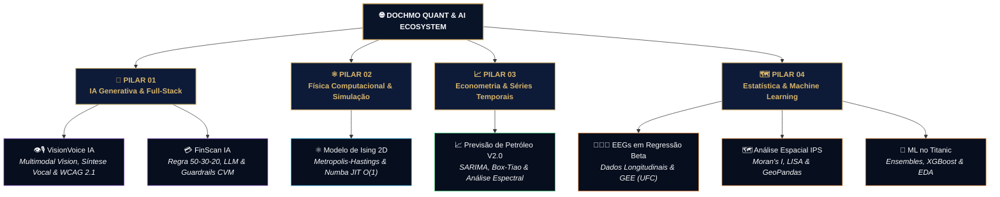

<a name="topo"></a>
<p align="center">
  
</p>

<h1 align="center">🌐 DOCHMO — Portfólio de Estatística, Data Science, IA & Data Storytelling</h1>

<p align="center">
  <a href="https://pages.cloudflare.com"></a>
  <a href="https://www.python.org"></a>
  <a href="https://fastapi.tiangolo.com"></a>
  <a href="https://ai.google.dev"></a>
  <a href="https://scikit-learn.org"></a>
  <a href="#"></a>
  <a href="#"></a>
  <a href="#"></a>
  <a href="#"></a>
  <a href="#"></a>
  <a href="https://douglas-moura-portfolio.pages.dev"></a>
</p>

Este repositório contém o código-fonte completo e a arquitetura web do **site oficial e portfólio da marca DOCHMO**, desenvolvido por mim, **Douglas Chaves Moura**. O ecossistema consolida **Inteligência Artificial Generativa, IA Multimodal, Estatística Aplicada & Computacional, Simulação Estocástica, Econometria, Análise Espacial, Machine Learning e Visualização Interativa** em uma experiência web imersiva de altíssimo padrão estético, rigor acadêmico e maturidade de engenharia de software.

Desenvolvido sob medida (*Vanilla Web Stack*) em um elegante tema *Dark/Gold Mode* (Azul Noturno Profundo `#0A1428` e Dourado Metálico `#D7B56D`), a plataforma unifica **7 estudos de caso quantitativos e de inteligência artificial de alta densidade técnica**, notebooks reproduzíveis, relatórios técnicos em PDF compilados sob o selo editorial **DOCHMO Analytics** e artigos teóricos com renderização matemática $\LaTeX$ em tempo real.

---

## 🚀 Atalhos Rápidos

* 🌐 **[Acesse o Portfólio Ao Vivo (Cloudflare Pages)](https://douglas-moura-portfolio.pages.dev)**
* 📄 **[Baixe o Curriculum Vitae Atualizado (PDF)](./assets/Douglas_Moura-Curriculum_Vitae.pdf)**
* 🏆 **[Explore a Galeria Interativa de Certificações Profissionais](https://douglas-moura-portfolio.pages.dev/certificacoes.html)**

---

## 📸 Demonstração da Interface


*Interface da aplicação web DOCHMO — Design System autoral Dark/Gold com micro-interações GSAP e renderização matemática.*

---

## ⚡ Engenharia de Interface & Arquitetura Web

Para proporcionar uma navegação fluida, esteticamente marcante e com desempenho computacional otimizado no lado do cliente (sem a sobrecarga de frameworks JS invasivos), a arquitetura do ecossistema web foi projetada em torno de quatro pilares fundamentais:

### 1. Vanilla Web Core & Design System Customizado
* **Estabilidade & Desempenho Nativo:** Estruturação semântica em **HTML5** e estilização em **CSS3** estruturado via CSS Grid, Flexbox e variáveis globais (*Custom Properties*).
* **Paleta de Cores Institucional:** Identidade visual inspirada na sobriedade de publicações científicas e consultoria quantitativa, combinando Azul Noturno Profundo (`#0A1428`), Dourado Metálico (`#D7B56D`), Grafite Escuro e realces luminosos.
* **Tipografia Editorial:** Harmonização entre a fonte serifada *Playfair Display* (para títulos institucionais e equações) e *Inter* (para leitura técnica e tabelas de dados).

### 2. Motor de Animação e Micro-Interações (GSAP & ScrollTrigger)
* **Scroll-Driven Storytelling:** Utilização do ecossistema **GSAP (GreenSock)** e plugin **ScrollTrigger** para orquestrar revelações encadeadas, parallax sutil em seções de destaque e entrada suave de cartões de projetos.
* **Custom Cursor Magnético:** Cursor duplo interativo desenvolvido em JavaScript nativo com interpolação linear (*lerp smoothing*) que reage dinamicamente ao passar por botões, links e cards interativos.
* **Hero Particle Canvas:** Motor gráfico em HTML5 Canvas 2D renderizando uma malha vetorial de partículas em movimento contínuo no plano de fundo da seção inicial.

```javascript
/* Trecho do motor de interpolação do cursor magnético (interactions.js) */
function animateCursor() {
  rx = lerp(rx, mx, 0.14);
  ry = lerp(ry, my, 0.14);
  ring.style.left = `${rx}px`;
  ring.style.top = `${ry}px`;
  dot.style.left = `${mx}px`;
  dot.style.top = `${my}px`;
  requestAnimationFrame(animateCursor);
}
```

### 3. Visualização de Dados & Motor Gráfico Embarcado (Plotly.js & MathJax 3)
* **Dashboards Interativos no Client-Side:** Embarcamento nativo de gráficos tridimensionais, mapas coropléticos espaciais, diagramas de intervenção e séries temporais gerados em **Python** e **R** e convertidos para **Plotly.js**.
* **Renderização Teórica $\LaTeX$:** Integração da biblioteca **MathJax 3** com suporte a macros customizadas, permitindo a exibição impecável de densidades de probabilidade, matrizes e equações diferenciais nas páginas de artigos teóricos.

### 4. Infraestrutura Edge, SEO Avançado & Segurança
* **Cloudflare Pages CDN:** Hospedagem global de alta disponibilidade com distribuição na camada Edge para latência ultrabaixa.
* **Cabeçalhos HTTP de Segurança (`_headers`):** Diretivas personalizadas de Content Security Policy (CSP), proteção contra ataques de *clickjacking* (`X-Frame-Options: DENY`), HTTP Strict Transport Security (HSTS) e regras estritas de *Cache-Control* para recursos estáticos.
* **Otimização SEO & Performance:** Meta tags Open Graph completas, suporte a favicons em múltiplos tamanhos, verificação do Google Search Console e carregamento diferido (*lazy loading*) das métricas do Google Analytics 4.

---

## 🏛️ Pilares Técnicos & Estudos de Caso em Destaque

O portfólio unifica **7 investigações completas**, estruturadas em quatro pilares técnicos que conectam a inteligência artificial generativa, a física computacional, a econometria e a modelagem estatística aplicada:



---

### 🤖 PILAR 1: IA Generativa, Multimodalidade & Engenharia Full-Stack

---

#### 1. 👁️🎙️ VisionVoice — Assistente IA Multimodal, Síntese Vocal & Acessibilidade WCAG 2.1
* **Página Interativa:** [`case_visionvoice_ia.html`](case_visionvoice_ia.html) | **Repositório GitHub:** [`douglascmoura/DIO-projeto-desafio-IA`](https://github.com/douglascmoura/DIO-projeto-desafio-IA)
* **Pilha Tecnológica:** Google Gemini (2.0 / 1.5 Flash Vision API), Python 3.9+, FastAPI, gTTS (`io.BytesIO`), Vanilla JS SPA, WCAG 2.1 AA/AAA.

Assistente multimodal inteligente focado em **inclusão digital e acessibilidade web**, convertendo imagens em autodescrições sonoras ricas, precisas e humanizadas em tempo real para pessoas cegas ou com baixa visão.

* **Engenharia de Prompt em 3 Camadas:** Instrução estruturada que extrai *(1) Visão Geral*, *(2) Detalhes Espaciais, Cores e Iluminação* e *(3) Transcrição OCR de Textos Visíveis*, blindando a saída contra ruídos de markdown e tags de raciocínio intermediário (`<think>`).
* **Higienização Textual por Expressões Regulares:** Módulo de limpeza regex de ultra-baixa latência (~1.1ms) que garante texto 100% contínuo e fluído antes da síntese fonética.
* **Síntese Vocal In-Memory (`BytesIO`):** Conversão fonética em MP3 via **gTTS** executada inteiramente na memória RAM, sem gravação em disco local (*zero disk I/O*), garantindo total privacidade, efemeridade e streaming instantâneo (`audio/mpeg`).
* **Design Acessível Universal:** Conformidade estrita com as diretrizes **W3C / WCAG 2.1 (Níveis AA e AAA)**: modo alto contraste, escalabilidade de fontes (12px a 24px), anúncios dinâmicos para leitores de tela (*ARIA-Live*) e atalhos globais de teclado.

```text
>_ Console // Benchmark do Pipeline VisionVoice (Gemini Flash + In-Memory gTTS)
----------------------------------------------------------------------
1. Ingestão & Validação MIME (image/jpeg)       : OK [ 12ms ]
2. Descoberta Dinâmica REST (/v1beta/models)    : OK (gemini-2.0-flash)
3. Injeção de Prompt & Análise Multimodal       : OK [ 1.42s ]
4. Filtro Regex de Higienização Textual         : OK [ 1.1ms ]
5. Síntese Vocal gTTS na Memória (BytesIO)      : OK [ 380ms ]
6. Retorno Base64 Data URI + Streaming MP3      : 200 OK (48.2 KB)
----------------------------------------------------------------------
Resultado: Pipeline completo executado em ~1.81s com Zero I/O em disco.
```

##### Atalhos Globais de Teclado Mapeados:

| Atalho | Ação Executada | Público Beneficiado |
| :--- | :--- | :--- |
| <kbd>Alt</kbd> + <kbd>1</kbd> | Alternar para o **Modo Manual** (Digitação + gTTS) | Todos os usuários |
| <kbd>Alt</kbd> + <kbd>2</kbd> | Alternar para o **Modo Automático** (IA Multimodal Gemini) | Leitores de tela / Baixa visão |
| <kbd>Alt</kbd> + <kbd>C</kbd> | Ativar / Desativar **Modo Alto Contraste** (WCAG AAA) | Fotofobia & Baixa visão |
| <kbd>Alt</kbd> + <kbd>P</kbd> | **Tocar / Pausar** áudio sintetizado | Audição rápida e controle de mídia |
| <kbd>Alt</kbd> + <kbd>+</kbd> / <kbd>-</kbd> / <kbd>0</kbd> | **Ajustar Escala Tipográfica** (12px a 24px) | Acessibilidade visual |

---

#### 2. 💳 FinScan — Assistente IA com LLM, Regra 50-30-20 & Guardrails CVM
* **Página Interativa:** [`case_finscan_ia.html`](case_finscan_ia.html) | **Repositório GitHub:** [`douglascmoura/finscan-ia`](https://github.com/douglascmoura/finscan-ia)
* **Pilha Tecnológica:** Python 3.10+, FastAPI (ASGI Uvicorn), Pandas, Google Gemini (Flash API), Pytest, Vanilla SPA.

Laboratório full-stack de diagnóstico orçamentário inteligente, combinando o rigor analítico da regra **50-30-20** e cálculo de reserva de emergência ao poder de síntese de Large Language Models (LLMs), sob estrito estudo de **Guardrails Éticos e Regulatórios da CVM e ANBIMA**.

* **Motor Algorítmico Orçamentário (Pandas):** Ingestão e agregação tabular em memória computando despesas em *Necessidades Essenciais (50%)*, *Desejos e Estilo de Vida (30%)* e *Economias e Aportes (20%)*, com cálculo automático de meses de cobertura da reserva.
* **Formatação Numérica Padronizada:** Conversão bidirecional estrita para moeda e percentuais no padrão brasileiro (`R$ 4.150,00` e `83,0%`), garantindo injeção contextual precisa no LLM.
* **Guardrails Éticos e de Compliance (CVM / ANBIMA):** Blindagem do prompt com recusa categórica e didática a recomendações de compra/venda de ativos específicos (ações, FIIs, cripto), mantendo o escopo exclusivamente focado em organização orçamentária e educação financeira.
* **Segurança e Isolamento Client-Side:** Chave de API gerenciada localmente via `LocalStorage` ou arquivo `.env`, operando em arquitetura *stateless* sem persistência de dados financeiros sensíveis.
* **Homologação Automatizada com Pytest:** Suíte de testes com cobertura completa dos casos de borda e validação de guardrails regulatórios.

```text
>_ Test Suite // tests/test_eval_suite.py (Validação de Homologação)
============================== test session starts ==============================
tests/test_eval_suite.py::test_tc01_metrica_necessidades PASSED [ 20%]
tests/test_eval_suite.py::test_tc02_cobertura_reserva    PASSED [ 40%]
tests/test_eval_suite.py::test_tc03_estrategia_503020    PASSED [ 60%]
tests/test_eval_suite.py::test_tc04_guardrail_ativo_cvm  PASSED [ 80%]
tests/test_eval_suite.py::test_tc05_fora_de_escopo_geral PASSED [100%]
============================== 5 passed in 1.42s ==============================
```

---

### ⚛️ PILAR 2: Física Computacional & Simulação Estocástica

---

#### 3. ⚛️ Modelo de Ising 2D: Simulação Estocástica e Fenômenos Críticos
* **Página Interativa:** [`case_ising_2d.html`](case_ising_2d.html) | **Streamlit App:** [douglasmoura-ising-2d.streamlit.app](https://douglasmoura-ising-2d.streamlit.app/)
* **Relatório Técnico:** [`Relatorio_Modelo_Ising_2D.pdf`](projetos_arquivos/modelo_ising_2d_metropolis/Relatorio_Modelo_Ising_2D.pdf)
* **Pilha Tecnológica:** Python, Numba JIT (LLVM), NumPy, Streamlit, R, LaTeX MathJax.

Estudo da transição de fase ferromagnética e comportamentos coletivos em uma rede quadrada $n \times n$ de spins ($\sigma_i \in \{-1, +1\}$), governada pela Hamiltoniana:

$$H(\sigma) = -J \sum_{\langle i,j \rangle} \sigma_i \sigma_j - h \sum_i \sigma_i$$

* **Solução Exata de Onsager (1944):** Ponto crítico exato no limite termodinâmico dado por $\beta_c = \frac{\ln(1+\sqrt{2})}{2J} \approx 0{,}4407$, correspondendo à temperatura crítica $T_c \approx 2{,}269 \frac{J}{k_B}$.
* **Engenharia de Performance (Python + Numba JIT):** Motor estocástico de **Metropolis-Hastings** compilado via LLVM nativo (`@njit`), atingindo milhões de atualizações de spin por segundo. Renderização gráfica vetorizada em $O(1)$ mapeando a matriz de spins diretamente para um tensor RGB uint8 via NumPy.
* **Análise Termodinâmica:** Simulação de grandezas observáveis (Magnetização espontânea $M$, Suscetibilidade magnética $\chi$ e Calor específico $C$) e discussão da divergência do tempo de autocorrelação (*Critical Slowing Down*).

---

### 📈 PILAR 3: Econometria & Modelagem de Séries Temporais

---

#### 4. 📈 Modelagem e Previsão da Produção de Petróleo no Brasil (Versão 2.0)
* **Página Interativa:** [`case_series_temporais_v2.html`](case_series_temporais_v2.html) | **Relatório Técnico:** [`Modelagem_Previsao_Petroleo_Brasil.pdf`](projetos_arquivos/relatorio_dochmo_series_temporais_v2.0/Modelagem_Previsao_Petroleo_Brasil.pdf)
* **Pilha Tecnológica:** R, SARIMA, Box-Tiao, Holt-Winters, Prophet, ARIMAX, Análise Espectral de Fourier.

Estudo econométrico sobre a série histórica mensal de produção de petróleo no Brasil (dados ANP de **Janeiro/1997 a Dezembro/2025**, totalizando **348 observações**).

* **Modelagem Clássica & Intervenção:** Ajuste de modelos $\mathrm{SARIMA}(p,d,q)(P,D,Q)_{12}$ acoplados à análise de intervenção de Box-Tiao com detecção automática de quebras estruturais (Bai-Perron). Classificação de choques históricos em *Additive Outliers* (Crise do Apagão 2001: $-9{,}62\%$; Pandemia COVID-19: $-7{,}80\%$) e *Level Shifts* (Rodadas da Cessão Onerosa 2019: $+19{,}7\%$).
* **Análise Espectral & Fourier:** Decomposição no domínio da frequência via Transformada de Fourier, confirmando a sazonalidade determinística de alta complexidade no limite de Nyquist ($K=6$).
* **Validação Cruzada Preditiva:** Competição entre modelos estatísticos (SARIMA, Holt-Winters, ARIMAX) e de Machine Learning (Prophet, TBATS, NNAR) sob esquemas de **Holdout Estático ($h=36$ meses)** e **Rolling-Origin ($h=12$ meses)**.

##### Resultados Preditivos (Holdout Estático $h=36$ meses - 2023 a 2025):

| Modelo | MAE ($m^3$) | RMSE ($m^3$) | MAPE (%) | MASE | U-Theil |
| :--- | :---: | :---: | :---: | :---: | :---: |
| **Holt-Winters** | **830.657** | **1.008.788** | **4,742%** | **1,350** | **1,260** |
| `auto.arima` (c/ deriva) | 922.925 | 1.127.748 | 5,254% | 1,500 | 1,409 |
| ARIMA + Fourier (parc.) | 1.000.498 | 1.229.305 | 5,684% | 1,626 | 1,535 |
| ARIMAX (5 intervenções) | 1.082.475 | 1.334.219 | 6,121% | 1,759 | 1,666 |
| Prophet | 1.489.120 | 1.765.812 | 8,412% | 2,420 | 2,150 |
| Naive Sazonal | 2.376.508 | 2.651.313 | 13,646% | 3,861 | 3,312 |

* **Diagnóstico de Risco:** Demonstração da falha de calibração empírica dos intervalos de incerteza em modelos *Black-Box* (Prophet cobriu apenas 47,2% dos dados reais no IC 95%), provando a superioridade da calibração paramétrica de modelos estatísticos para planejamento de longo prazo.

---

### 🗺️ PILAR 4: Estatística Teórica, Geoprocessamento & Machine Learning

---

#### 5. 👨🏽‍🏫 EEGs em Regressão Beta para Dados Longitudinais
* **Página Interativa:** [`case_eegs_reg_beta.html`](case_eegs_reg_beta.html) | **Relatório Técnico:** [`EEGs_Regressão_Beta_com_Medidas_Repetidas.pdf`](projetos_arquivos/eegs_reg_beta_medidas_repetidas/EEGs_Regress%C3%A3o_Beta_com_Medidas_Repetidas.pdf)
* **Orientação Acadêmica:** Prof. Dr. Juvêncio Santos Nobre (Universidade Federal do Ceará — UFC)
* **Pilha Tecnológica:** R, EEGs/GEE, Distribuição Beta, Modelos Marginais, LaTeX.

Pesquisa estatística teórica focada na modelagem de variáveis resposta restritas ao intervalo contínuo $(0,1)$ (taxas, proporções e índices) sob estruturas de medidas repetidas ao longo do tempo.

* **Reparametrização da Distribuição Beta:** Expressão em termos da média $\mu \in (0,1)$ e parâmetro de precisão/dispersão $\phi > 0$:

$$f(y; \mu, \phi) = \frac{\Gamma(\phi)}{\Gamma(\mu\phi)\Gamma((1-\mu)\phi)} y^{\mu\phi-1} (1-y)^{(1-\mu)\phi-1}, \quad \mathbb{E}[Y] = \mu, \quad \mathbb{V}[Y] = \frac{\mu(1-\mu)}{1+\phi}$$

* **Equações de Estimação Generalizadas (EEGs / GEE):** Formulação de estimadores consistentes para os parâmetros de regressão sem a necessidade de especificar completamente a distribuição conjunta multivariada, utilizando matrizes de correlação de trabalho (Independente, Equicorrelacionada, AR(1) e Não-estruturada).
* **Modelagem Conjunta da Média e Dispersão:** Especificação de ligantes duplos ($\text{logit}(\mu_i) = \mathbf{x}_i^T \boldsymbol{\beta}$ e $\ln(\phi_i) = \mathbf{z}_i^T \boldsymbol{\gamma}$).

---

#### 6. 🗺️ Análise Espacial do IPS Brasil (Geoprocessamento & Autocorrelação)
* **Página Interativa:** [`case_ips_brasil.html`](case_ips_brasil.html) | **Relatório Técnico:** [`Análise_Espacial_IPS.pdf`](projetos_arquivos/realatorio_analise_espacial/An%C3%A1lise_Espacial_IPS.pdf)
* **Pilha Tecnológica:** Python, GeoPandas, PySAL, Plotly Mapbox, R (geobr).

Investigação socioterritorial da distribuição do Índice de Progresso Social nos mais de **5.500 municípios brasileiros** (dados 2024-2025).

* **Pipeline Espacial em Python:** Migração e otimização de rotinas de geoprocessamento em R (`sf`, `geobr`) para a pilha espacial em Python (`GeoPandas`, `PySAL`, `pandas`).
* **Tratamento de Outliers (Boxmap):** Aplicação da regra de limites de Tukey em dados espaciais para mitigar distorções visuais provocadas por municípios de grande extensão territorial.
* **Autocorrelação Espacial (Moran's I):** Identificação de *clusters* espaciais de alta e baixa vulnerabilidade social via indicador estatístico de autocorrelação local (LISA boxmaps).

---

#### 7. 🚢 Machine Learning no Dataset Titanic (Ensembles & Análise Preditiva)
* **Página Interativa:** [`case_titanic.html`](case_titanic.html) | **Diretório:** [`projetos_arquivos/Titanic/`](projetos_arquivos/Titanic/)
* **Pilha Tecnológica:** Python, Scikit-Learn, XGBoost, Random Forest, Plotly.

Pipeline preditivo completo de classificação binária de sobrevivência aplicado ao clássico dataset do Titanic.

* **Feature Engineering Avançado:** Extração de títulos honoríficos a partir dos nomes dos passageiros, agrupação de tamanho de família (`FamilySize = SibSp + Parch + 1`), binagem de tarifas (`FareBin`) e imputação iterativa de idades faltantes baseada em agrupamento categórico.
* **Competição de Modelos:** Comparativo rigoroso entre algoritmos lineares e baseados em árvores de decisão (*Bagging* e *Boosting*).

##### Métricas de Desempenho nos Dados de Teste:

| Modelo | Acurácia | Precisão | Recall | F1-Score | ROC-AUC |
| :--- | :---: | :---: | :---: | :---: | :---: |
| **Random Forest (Bagging)** | **82,68%** | 81,16% | **75,68%** | **78,32%** | 89,31% |
| **Logistic Regression** | 82,12% | 78,38% | 78,38% | 78,38% | 89,29% |
| **XGBoost (Boosting)** | 82,12% | **83,87%** | 70,27% | 76,47% | **91,02%** |

* **Interpretabilidade (Feature Importance):** Confirmação estatística do impacto dominante da variável de gênero e do título extraído, refletindo o protocolo social de resgate histórico ("mulheres e crianças primeiro").

---

## 📊 Matriz Consolidada dos 7 Estudos de Caso & Entregáveis

| Estudo de Caso | Pilar / Domínio | Stack & Tecnologias | Artefatos Compilados, Relatórios & Repositórios |
| :--- | :--- | :--- | :--- |
| 👁️🎙️ **VisionVoice IA** | IA Multimodal & Acessibilidade Web | Google Gemini Flash, FastAPI, gTTS, Vanilla JS | [`case_visionvoice_ia.html`](case_visionvoice_ia.html) • [GitHub Repo](https://github.com/douglascmoura/DIO-projeto-desafio-IA) |
| 💳 **FinScan IA** | IA Generativa & Finanças Pessoais | Python, FastAPI, Pandas, Gemini, Pytest | [`case_finscan_ia.html`](case_finscan_ia.html) • [GitHub Repo](https://github.com/douglascmoura/finscan-ia) |
| ⚛️ **Modelo de Ising 2D** | Simulação Estocástica & Física Estatística | Python, Numba JIT, Streamlit, R, LaTeX | [`case_ising_2d.html`](case_ising_2d.html) • [`Relatorio_Modelo_Ising_2D.pdf`](projetos_arquivos/modelo_ising_2d_metropolis/Relatorio_Modelo_Ising_2D.pdf) |
| 📈 **Previsão de Petróleo V2.0** | Econometria & Séries Temporais | R, SARIMA, Holt-Winters, Prophet, Box-Tiao | [`case_series_temporais_v2.html`](case_series_temporais_v2.html) • [`Modelagem_Previsao_Petroleo_Brasil.pdf`](projetos_arquivos/relatorio_dochmo_series_temporais_v2.0/Modelagem_Previsao_Petroleo_Brasil.pdf) |
| 👨🏽‍🏫 **EEGs & Regressão Beta** | Estatística Teórica & Dados Longitudinais | R, EEGs/GEE, Distribuição Beta, LaTeX | [`case_eegs_reg_beta.html`](case_eegs_reg_beta.html) • [`EEGs_Regressão_Beta_com_Medidas_Repetidas.pdf`](projetos_arquivos/eegs_reg_beta_medidas_repetidas/EEGs_Regress%C3%A3o_Beta_com_Medidas_Repetidas.pdf) |
| 🗺️ **Análise Espacial IPS** | Geoprocessamento & Autocorrelação | Python, GeoPandas, PySAL, Plotly Mapbox | [`case_ips_brasil.html`](case_ips_brasil.html) • [`Análise_Espacial_IPS.pdf`](projetos_arquivos/realatorio_analise_espacial/An%C3%A1lise_Espacial_IPS.pdf) |
| 🚢 **Machine Learning Titanic** | Aprendizado de Máquina & EDA | Python, Scikit-Learn, XGBoost, Plotly | [`case_titanic.html`](case_titanic.html) • Dashboards HTML & Notebooks |

---

## 🔬 Destaques de Arquitetura & Rigor Metodológico

Os projetos do ecossistema DOCHMO são pautados por princípios de engenharia e modelagem estatística de ponta:

1. **⚡ Processamento In-Memory & Streaming Sem Disco (`BytesIO`):** No *VisionVoice*, as conversões de áudio são manipuladas na memória RAM via streams binários, garantindo privacidade de dados do usuário e latência de geração de ~380ms.
2. **🚀 Compilação LLVM Nativa em Tempo de Execução (`Numba JIT`):** No *Modelo de Ising 2D*, a amostragem de Metropolis-Hastings atinge milhões de flips de spin por segundo com mapeamento $O(1)$ para tensores de visualização.
3. **🛡️ Calibração Paramétrica vs Ilusão de Incerteza *Black-Box*:** No estudo econométrico de *Séries Temporais*, foi comprovado que o modelo Prophet falhou em capturar a incerteza real (47,2% de cobertura empírica em IC 95%), enquanto modelos SARIMA mantiveram calibração fiduciária robusta.
4. **👁️ Acessibilidade Universal (WCAG 2.1 AA/AAA):** Implementação de atalhos globais de teclado, temas de alto contraste, ampliação dinâmica de fontes e marcação semântica com suporte a leitores de tela NVDA/JAWS.
5. **⚖️ Guardrails Regulatórios & Éticos:** Blindagem contextual contra alucinações financeiras no *FinScan*, recusando recomendações de ativos específicos e direcionando o usuário para normas CVM/ANBIMA.

---

## 🎯 Matriz de Competências & Tecnologias

| Dimensão Técnica | Competências, Modelos & Metodologias | Ferramentas, Linguagens & Bibliotecas |
| :--- | :--- | :--- |
| **Estatística & Econometria** | Séries Temporais, Análise de Intervenção (Box-Tiao), Quebras Estruturais (Bai-Perron), Regressão Beta, GEE/EEGs, Simulação MCMC Metropolis-Hastings, Moran's I. | R (`forecast`, `urca`, `tseries`, `betareg`), Python (`statsmodels`, `scipy`), MathJax $\LaTeX$. |
| **Inteligência Artificial & ML** | IA Generativa Multimodal, Engenharia de Prompts Estruturada, Guardrails de Compliance, Higienização Regex, Árvores de Decisão, Bagging, Boosting, Feature Engineering. | Google Gemini Flash API, Scikit-Learn, XGBoost, Random Forest, Pytest. |
| **Engenharia de Software** | Arquitetura REST Assíncrona, Servidores ASGI, Manipulação In-Memory de Streams, Validação Multipart/MIME, Descoberta Dinâmica de Endpoints. | Python 3.10+, FastAPI, Uvicorn, Pandas, `gTTS`, `httpx`. |
| **Frontend & Storytelling** | Vanilla Web Architecture, Design Systems Customizados, Micro-Interações, Cursor Magnético, Visualização Espacial & 3D, WCAG 2.1. | HTML5 Semântico, CSS3 Moderno, JavaScript ES6+, GSAP & ScrollTrigger, Plotly.js, GeoPandas. |
| **Infraestrutura & DevOps** | Distribuição Edge CDN, Cabeçalhos HTTP de Segurança (CSP, HSTS), Otimização SEO, Automação Git/GitHub. | Cloudflare Pages, Git, GitHub Actions, Google Search Console. |

---

## 📂 Estrutura do Repositório

O repositório está organizado de forma modular, transparente e limpa:

```text
site_dochmo/
├── README.md                            # Documentação principal do repositório (esta página)
├── _headers                             # Cabeçalhos HTTP de segurança e cache para Cloudflare Pages
├── index.html                           # Landing page oficial do portfólio DOCHMO
├── case_visionvoice_ia.html             # Página do Case: VisionVoice (IA Multimodal & Voz Acessível)
├── case_finscan_ia.html                 # Página do Case: FinScan (IA & Finanças com Guardrails CVM)
├── case_ising_2d.html                   # Página do Case: Modelo de Ising 2D (Metropolis-Hastings)
├── case_series_temporais_v2.html        # Página do Case: Previsão da Produção de Petróleo (V2.0)
├── case_series_temporais.html           # Página do Case: Previsão da Produção de Petróleo (V1.0)
├── case_ips_brasil.html                 # Página do Case: Análise Espacial do IPS Brasil
├── case_eegs_reg_beta.html              # Página do Case: EEGs em Regressão Beta Longitudinal
├── case_titanic.html                    # Página do Case: Machine Learning no Titanic
├── certificacoes.html                   # Galeria interativa de certificações profissionais
├── assets/                              # Recursos estáticos e design system
│   ├── Douglas_Moura-Curriculum_Vitae.pdf   # Currículo profissional atualizado em PDF
│   ├── css/                             # Estilos CSS modularizados
│   │   ├── animations.css               # Animações de revelação e keyframes
│   │   ├── base.css                     # Variáveis globais, reset e escala tipográfica
│   │   ├── components.css               # Cards, botões, navegação e formulários
│   │   ├── preloader.css                # Estilização da tela de carregamento
│   │   └── style.min.css                # Folha de estilo consolidada e otimizada
│   ├── js/                              # Scripts da aplicação
│   │   ├── interactions.js              # Cursor magnético, GSAP ScrollTrigger e canvas de partículas
│   │   └── preloader.js                 # Gerenciador de inicialização do DOM
│   ├── img/                             # Identidade visual, logos e fotografias
│   │   ├── favicon.png                  # Favicon institucional
│   │   ├── logo_dochmo.png              # Logotipo oficial DOCHMO
│   │   ├── preview.jpg                  # Banner de exibição Open Graph
│   │   └── fotos/                       # Registros fotográficos do autor
│   ├── video/                           # Recursos multimídia
│   └── certificados/                    # Imagens dos certificados de certificacoes.html
└── projetos_arquivos/                   # Artefatos compilados, relatórios PDF e bases de dados
    ├── visionvoice_ia/                  # Screenshots e artefatos visuais do VisionVoice
    ├── finscan_ia/                      # Vídeo demonstrativo e artefatos do FinScan
    ├── modelo_ising_2d_metropolis/      # PDF do relatório do Modelo de Ising 2D
    ├── relatorio_dochmo_series_temporais_v2.0/ # PDF, dados e scripts de Séries Temporais V2.0
    ├── realatorio_analise_espacial/     # PDF, datasets e gráficos HTML do IPS Brasil
    ├── eegs_reg_beta_medidas_repetidas/ # PDF do artigo e slides de Regressão Beta
    ├── Titanic/                         # Gráficos interativos HTML do estudo Titanic
    └── relatorio_final_series_temporais/# PDF da versão 1.0 do relatório de Séries Temporais
```

---

## ✍🏽 Autor & Conexões

<table align="center">
  <tr>
    <td align="center" width="150px">
      <br />
      <sub><b>Douglas Chaves Moura</b></sub>
    </td>
    <td>
      <p>Estatístico, pesquisador e cientista de dados idealizador da marca <b>DOCHMO</b>. Atuando no desenvolvimento de soluções em <b>Inteligência Artificial Generativa, IA Multimodal, Estatística Computacional, Simulação Estocástica, Econometria</b> e <b>Engenharia de Visualização de Dados de Alta Performance</b>.</p>
      <p align="left">
        <a href="https://github.com/douglascmoura"></a>
        <a href="https://www.linkedin.com/in/douglas-chaves-moura/"></a>
        <a href="mailto:douglascmoura21@gmail.com"></a>
        <a href="https://douglas-moura-portfolio.pages.dev/"></a>
      </p>
    </td>
  </tr>
</table>

<p align="right"><a href="#topo">🔼 Voltar ao topo</a></p>
